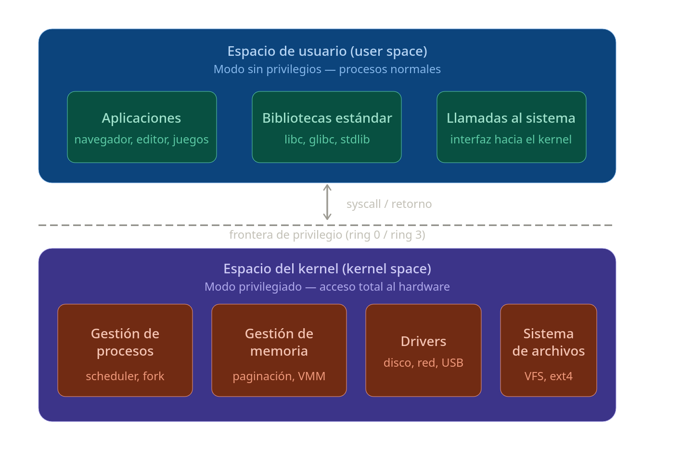

# TP4 — Módulos de Kernel

### Grupo: Apache Tevez

### Profesores:

- Miguel Angel Solinas

- Javier Jorge

## Integrantes

| Nombre                            | Correo Electrónico                |
| --------------------------------- | --------------------------------- |
| Facundo Emanuel Avila Diaz Moreno | facundo.avila.027@mi.unc.edu.ar   |
| Candela Abigail Vergara           | candela.vergara@mi.unc.edu.ar     |
| Joaquín Alejandro Salinas         | joaquin.salinas.874@mi.unc.edu.ar |

---

## Desafío #1

### ¿Qué es el checkinstall y para qué sirve?

El `checkinstall` es un programa que reemplaza al `make install` y en lugar de instalar los archivos sueltos por el sistema, crea un paquete .deb (o .rpm). De esta manera se puede desinstalar limpiamente después con el gestor de paquetes y tener un registro de qué archivos instaló el programa.

Esto permite:

- Desinstalar el software limpiamente con el gestor de paquetes (`apt remove` o `dnf remove`)
- Tener un registro de qué archivos instaló el programa
- Distribuir el software empaquetado a otras máquinas

Es especialmente útil cuando se quiere instalar software que no está en los
repositorios oficiales y se compila desde el código fuente.

### Empaquetando un Hello World con checkinstall

Se creó un programa `hello.c` mínimo y su `Makefile` correspondiente:

**hello.c**
\```c
#include <stdio.h>

int main() {
printf("Hello, World!\n");
return 0;
}
\```

**Makefile**
\```makefile
all:
gcc -o hello hello.c

install:
cp hello /usr/local/bin/hello

clean:
rm -f hello
\```

Se compiló y empaquetó con checkinstall:
\```bash
make
sudo checkinstall --pkgname=hello --pkgversion=1.0 --nodoc
\```

El resultado fue el paquete `hello_1.0-1_amd64.deb` instalado en el sistema,
verificable con:
\```bash
dpkg -l | grep hello
\```


### Revisar la bibliografía para impulsar acciones que permitan mejorar la seguridad del kernel, concretamente: evitando cargar módulos que no estén firmados. rootkits ?

Un rootkit es un módulo malicioso que se instala en el kernel para tener control total del sistema de forma oculta. Para prevenirlos, Linux implementa la firma de módulos junto con Secure Boot.

El mecanismo funciona así:

- Cada módulo debe estar firmado con una clave privada
- El kernel verifica la firma contra las claves públicas registradas
- Si secure Boot está habilitado y el módulo no tiene firma válida, la carga falla directamente

Cuando un módulo se carga sin firma (como ocurre con mimodulo.ko), el kernel lo indica con:
`module verification failed: signature and/or required key missing - tainting kernel`

La palabra "tainting" indica que el kernel fue "contaminado" con
código no verificado, lo cual es una señal de advertencia de seguridad.
=======

## Desafío #2

### ¿ Qué funciones tiene disponible un programa y un módulo ?

Un programa tiene acceso a sus propias funciones definidas localmente, más todo lo que importa explícitamente de módulos externos. Un módulo, en cambio, es una unidad independiente que expone una interfaz pública (sus funciones exportadas) y puede a su vez importar de otros módulos.

### Funciones disponibles para un Programa

Un programa en ejecución tiene acceso a cuatro grandes grupos de funciones:

- 1. **Funciones propias:** Las que el programador definió directamente en el código fuente (por ejemplo main(), funciones auxiliares, etc.).
- 2. **Funciones de biblioteca estándar:** Se enlazan durante la compilación o en tiempo de ejecución. Son funciones ya implementadas que el sistema provee (printf, malloc, strlen, etc.).
- 3. **Funciones de módulos importados:** Cualquier función pública que se haya importado de otro módulo o librería externa. Solo se accede a las que el módulo exporta.
- 4. **Llamadas al sistema (syscalls):** Interfaz directa con el sistema operativo. Son los servicios que el SO expone para manejo de archivos (open, read, write), procesos (fork, exec), redes (socket), memoria, etc.

---

### Funciones disponibles para un Módulo

Un módulo tiene una estructura diferente, orientada a la encapsulación:

- 1. **Interfaz pública (exportadas):** Son las funciones que el módulo decide exponer hacia afuera. Solo estas son visibles para quien importa el módulo.
- 2. **Funciones privadas (internas):** Funciones de uso interno, no accesibles desde fuera. Permiten organizar el código del módulo sin "contaminar" el espacio de nombres global.
- 3. **Dependencias importadas:** El módulo también puede importar otros módulos, accediendo a sus funciones públicas.
- 4. **Syscalls (indirecto):** Un módulo puede hacer syscalls si lo necesita, pero generalmente esta responsabilidad se delega a librerías del sistema o al programa principal que lo usa.

---

### Espacio de usuario o espacio del kernel.

El sistema operativo divide la memoria en dos zonas estrictamente separadas:

- Espacio de usuario: Es donde corren todos los programas normales: el navegador, el editor de texto, cualquier aplicación. Los procesos operan en modo sin privilegios (ring 3 en x86), por lo que no pueden acceder directamente al hardware ni a la memoria de otros procesos. Si necesitan algo del sistema, como leer un archivo o abrir un socket, deben pedírselo al kernel mediante una syscall.

- Espacio del kernel: Es donde corre el núcleo del sistema operativo, con acceso total al hardware (nivel de privilegio 0). Gestiona procesos, memoria, drivers y el sistema de archivos. Si un programa en el espacio de usuario comete un error grave, solo muere ese proceso.



La frontera entre ambos es una barrera de hardware - el procesador mismo la impone.

---

### Espacio de datos.

### Drivers. Investigar contenido de /dev.

## Preguntas

#### 1. ¿Qué diferencias se pueden observar entre los dos modinfo?

La diferencia principal es que `des_generic.ko.zst` es un módulo **oficial del kernel**
(in-tree), mientras que `mimodulo.ko` es un módulo **externo** (out-of-tree).

Las diferencias concretas son:

- **Firma**: `des_generic` está firmado con una clave autogenerada durante la
  compilación del kernel (`signer: Build time autogenerated kernel key`).
  `mimodulo` no tiene firma, por eso al cargarlo el kernel advierte
  `tainting kernel`.

- **Formato**: `des_generic` está comprimido (`.ko.zst`), `mimodulo` no.

- **Origen**: `des_generic` tiene `intree: Y`, lo que indica que viene incluido
  con el kernel. `mimodulo` no tiene este campo.

- **Aliases**: `des_generic` tiene múltiples aliases (`des`, `des3_ede`, etc.)
  que permiten al kernel cargarlo automáticamente cuando se necesita.
  `mimodulo` no tiene aliases.

- **Dependencias**: `des_generic` depende de `libdes`. `mimodulo` no tiene
  dependencias.

#### 2. ¿Qué divers/modulos estan cargados en sus propias pc?


#### 3. ¿Cuales no están cargados pero están disponibles? que pasa cuando el driver de un dispositivo no está disponible

El sistema tiene 6773 módulos disponibles en
`/lib/modules/$(uname -r)/kernel`, pero solo 125 están cargados
actualmente (según `lsmod`). El resto están disponibles en disco
pero el kernel no los necesita en este momento.

Los módulos no cargados se encuentran en categorías como:

- `drivers/` — drivers de hardware no presente en el sistema
- `fs/` — sistemas de archivos no montados
- `net/` — protocolos de red no utilizados
- `crypto/` — algoritmos criptográficos no requeridos

**¿Qué pasa cuando el driver de un dispositivo no está disponible?**
Si conectás un dispositivo y el kernel no tiene el módulo correspondiente
ni en memoria ni en disco, el dispositivo no funciona — no aparece en
`/dev`, no puede ser usado por ningún programa. El kernel registra en
`dmesg` que no encontró el driver para ese dispositivo.

#### 9. Agregar evidencia de la compilación, carga y descarga de su propio módulo imprimiendo el nombre del equipo en los registros del kernel.

Se modificó `mimodulo.c` para imprimir el nombre del equipo en los
registros del kernel. Se agregó "apache-tevez" en ambas funciones
`init` y `exit`:

```c
printk(KERN_INFO "Modulo cargado en el kernel - apache-tevez\n");
printk(KERN_INFO "Modulo descargado del kernel - apache-tevez\n");
```

Se compiló con `make` y se cargó con `insmod`:


Como se puede observar, el módulo se cargó y descargó correctamente,
imprimiendo el nombre del equipo en el log del kernel.

#### 10. ¿Que pasa si mi compañero con secure boot habilitado intenta cargar un módulo firmado por mi?

Si un compañero intenta cargar un módulo firmado con mi clave privada
en su sistema con Secure Boot habilitado, la carga va a fallar.

Esto ocurre porque Secure Boot verifica la firma del módulo contra las
claves públicas registradas en su sistema. Mi clave pública no está
registrada en el sistema de mi compañero, por lo tanto el kernel no
puede verificar la firma y rechaza el módulo con:

`module verification failed: signature and/or required key missing`

Para que funcione, mi compañero tendría que registrar mi clave pública
en su sistema usando MOK (Machine Owner Key):

```bash
sudo mokutil --import mi_clave_pub.der
```

Recién ahí su kernel confiaría en módulos firmados con mi clave privada.


#### 11. Dada la siguiente nota https://arstechnica.com/security/2024/08/a-patch-microsoft-spent-2-years-preparing-is-making-a-mess-for-some-linux-users/ 

#####  a. ¿Cuál fue la consecuencia principal del parche de Microsoft sobre GRUB en sistemas con arranque dual (Linux y Windows)?

La consecuencia principal fue que muchos sistemas con arranque dual (dual-boot) dejaron de arrancar en Linux, quedando completamente inutilizados al intentar iniciar ese sistema operativo.

Al encender la computadora e intentar cargar Linux mediante el gestor de arranque GRUB, los usuarios se encontraban con un bloqueo del sistema y pantallas de error con mensajes críticos como:

"Verifying shim SBAT data failed: Security Policy Violation. Something has gone seriously wrong: SBAT self-check failed: Security Policy Violation".

Esto ocurrió porque el parche de Windows aplicó una actualización de SBAT (Secure Boot Advanced Targeting) para bloquear versiones antiguas y vulnerables de GRUB (asociadas a la vulnerabilidad de desbordamiento de búfer CVE-2022-2601). Aunque Microsoft aseguró que la restricción no se aplicaría a sistemas con arranque dual configurado, un fallo en la distribución del parche provocó que sí se instalara en estas computadoras, bloqueando las firmas digitales de varios gestores de arranque de distribuciones populares como Ubuntu, Debian, Linux Mint y Zorin OS.

##### b. ¿Qué implicancia tiene desactivar Secure Boot como solución al problema descrito en el artículo?
Desactivar Secure Boot en la BIOS/UEFI funciona como la solución inmediata (o bypass temporal) para poder volver a ingresar a Linux y limpiar las políticas de SBAT corruptas mediante la terminal (usando comandos como sudo mokutil --set-sbat-policy delete).

Sin embargo, mantenerlo desactivado de forma permanente tiene implicancias negativas en la seguridad:

Pérdida de la raíz de confianza: El sistema operativo pierde la capacidad de verificar si el firmware, el cargador de arranque o los módulos principales del kernel han sido alterados o reemplazados por software malicioso.

Vulnerabilidad ante malware de arranque: El equipo queda expuesto a ataques de nivel de firmware, como rootkits o bootkits, que se ejecutan antes de que el antivirus o las protecciones del sistema operativo puedan cargarse.

Restricciones en Windows: Algunas funciones avanzadas de aislamiento de núcleo en Windows o aplicaciones muy específicas (como ciertos sistemas antitrampas de videojuegos modernos) requieren obligatoriamente que Secure Boot esté activo para ejecutarse.

##### c. ¿Cuál es el propósito principal del Secure Boot en el proceso de arranque de un sistema?
El propósito principal de Secure Boot (Arranque Seguro) es garantizar que una computadora arranque utilizando únicamente software en el que confía el fabricante del equipo (OEM).

Durante el encendido, el firmware UEFI intercepta la carga de cada pieza de código inicial —incluyendo el cargador de arranque (como GRUB o el Windows Boot Manager), los controladores de firmware UEFI y los módulos del kernel—. Antes de ejecutarlos, verifica sus firmas criptográficas contra una base de datos de claves públicas e índices autorizados almacenados de forma segura en el hardware. Si el código está firmado por una entidad de confianza (como Microsoft o las claves de las distribuciones de Linux validadas), se permite su ejecución; si la firma no coincide, está ausente o ha sido revocada (como intentó hacer el parche mediante SBAT), el proceso se detiene de inmediato para evitar que software malicioso tome el control total del hardware.
